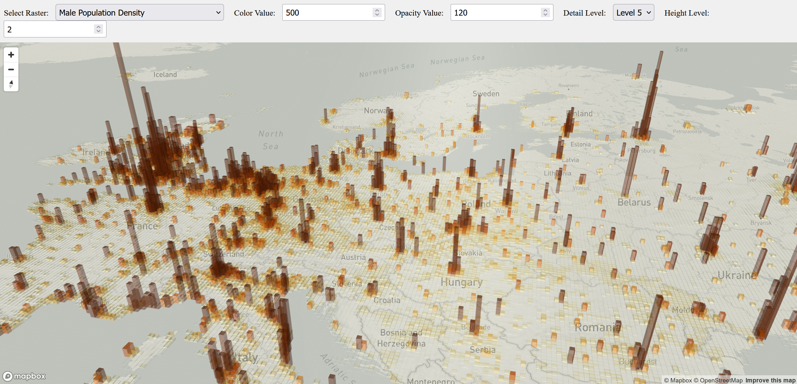

# Interactive Population Density Visualization

## Overview

This project creates an interactive 2.5D visualization of global population densities using deck.gl. Population density is represented through both height and color saturation, making demographic patterns easily recognizable. The web application allows users to explore population data from global to regional scales.



## Prerequisites

- Python 3.x
- Node.js
- Mapbox [access token](https://docs.mapbox.com/help/getting-started/access-tokens/)
- Download the demographic dataset from [SEDAC CIESIN](https://www.earthdata.nasa.gov/data/catalog/sedac-ciesin-sedac-gpwv4-bdc-r11-4.11)
  - Select: DIRECT DOWNLOAD
  - Files: All
  - Temporal: Combined Five Year Age Groups
  - Format: NetCDF
  - Resolution: 2.5 Minute

## Setup Instructions

### Data Loading (once)

1. Data preparation:

- Unzip the downloaded dataset
- Move `gpw_v4_basic_demographic_characteristics_rev11_mt_2010_dens_2pt5_min.nc` to the `/data` folder
- Run the data loading notebook:

2. Navigate into /src/backend/notebooks

```bash
cd /src/backend/notebooks
```

```bash
python3 -m venv venv
source venv/bin/activate
```

3. Install dependencies:

```bash
pip install -r requirements.txt
```

4. Run Notekook to create the database quadkeyDB.sqlite in /data

```bash
jupyter notebook loadDataSQLite.ipynb
```

### Backend Setup

0. Navigate into src/backend/fastAPI

```bash
cd src/backend/fastAPI
```

1. Create and activate Python virtual environment:

```bash
python3 -m venv venv
source venv/bin/activate
```

2. Install dependencies:

```bash
pip install -r requirements.txt
```

4. Start the backend server:

```bash
fastapi dev mainSqlite.py
```

### Frontend Setup

1. Navigate to the frontend folder (/src/frontend/deckgl) and install dependencies:

```bash
npm install
```

2. Configure Mapbox token (choose one method):

```bash
# Option 1: Environment variable
export MapboxAccessToken=<your_mapbox_token>

# Option 2: Direct configuration in app.tsx
# Set MAPBOX_TOKEN in the source code
```

3. Start the development server:

```bash
npm start
```
